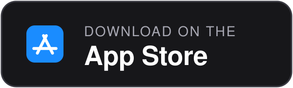
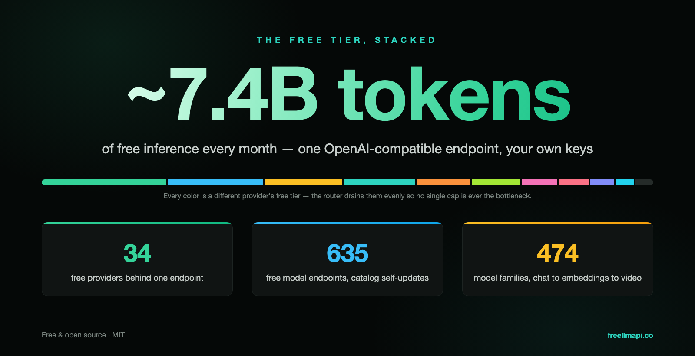
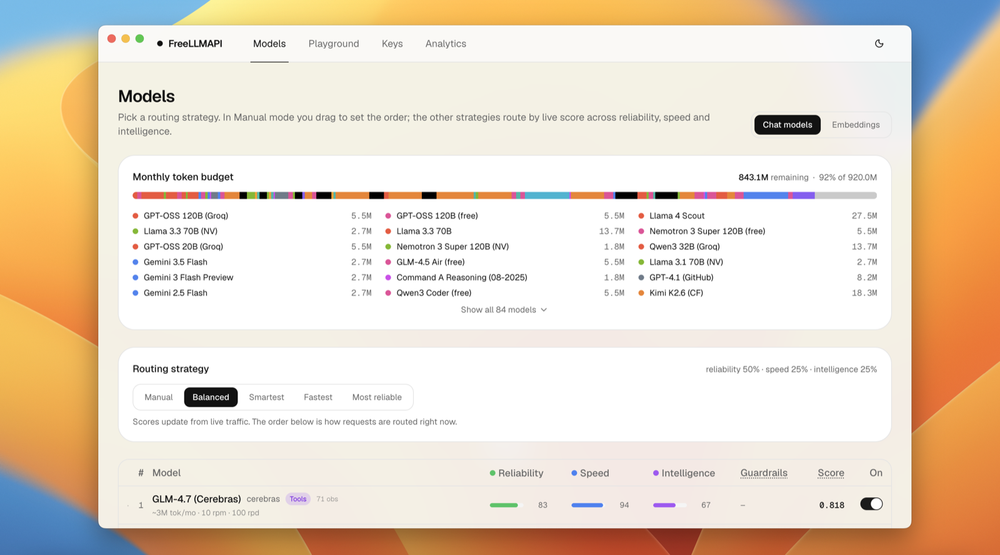
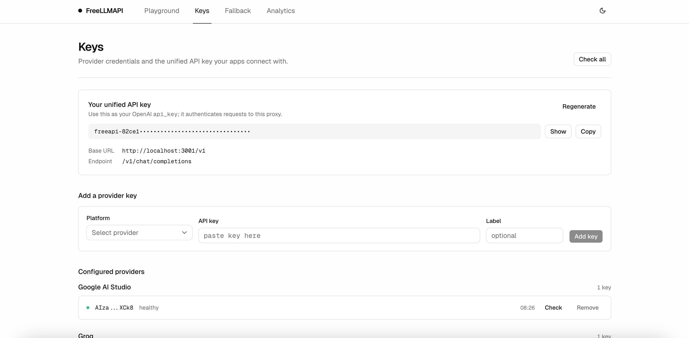
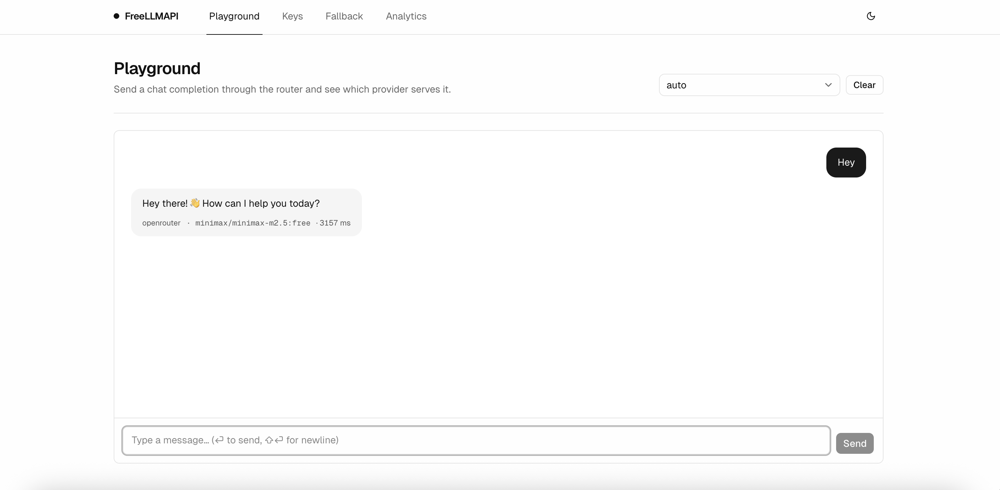
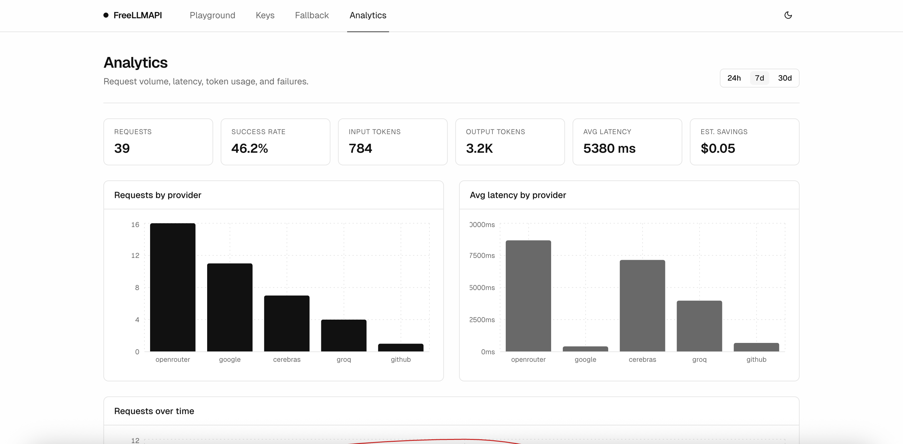

<div align="center">

# FreeLLMAPI

**7,4 миллиарда токенов в месяц. 34 бесплатных LLM-провайдера. 635 бесплатных модельных эндпоинтов. Один OpenAI-совместимый API.**

Объединяйте бесплатные тарифы десятков провайдеров, а также собственные OpenAI-совместимые эндпоинты для чата, эмбеддингов, генерации изображений и работы с аудио через единый API `/v1`. Ключи хранятся в зашифрованном виде. Маршрутизатор выбирает наиболее подходящую доступную модель, при ограничении запросов переключается на другого провайдера и учитывает расход по каждому ключу, помогая соблюдать бесплатные квоты.

[](https://github.com/tashfeenahmed/freellmapi/actions/workflows/ci.yml)
[](https://github.com/tashfeenahmed/freellmapi/stargazers)
[](./LICENSE)
[](#contributing)
[](https://github.com/tashfeenahmed/freellmapi/pkgs/container/freellmapi)
[](https://deepwiki.com/tashfeenahmed/freellmapi)

**[freellmapi.co](https://freellmapi.co/?utm_source=github&utm_medium=readme&utm_campaign=repository&utm_content=readme_top)** · полный каталог: 474 семейства моделей и 635 бесплатных эндпоинтов

[English](README.md) · [简体中文](README.zh-cn.md) · **Русский**

Русский перевод может обновляться с задержкой. Самую актуальную информацию смотрите в английском [README](README.md).

<p align="center">
  <a href="https://github.com/tashfeenahmed/freellmapi/releases/latest"></a>
  <a href="https://github.com/tashfeenahmed/freellmapi/releases/latest"></a>
  <a href="docs/en/install/01-install.md#docker-compose"></a>
  <a href="https://play.google.com/store/apps/details?id=co.freellmapi.app"></a>
  <a href="https://apps.apple.com/app/id6804648934"></a>
</p>


Маршрутизатор самостоятельно обновляет каталог моделей из подписанного источника. Новые бесплатные модели, изменения квот и исправления совместимости поступают без `git pull`. В бесплатной версии доступен ежемесячный снимок каталога: модель появляется в нём спустя 30 дней после публикации в оперативном каталоге. Пользователи Premium получают обновления в тот же день.
**[Подключить оперативный каталог на freellmapi.co](https://freellmapi.co/?utm_source=github&utm_medium=readme&utm_campaign=premium&utm_content=readme_top#pricing)** ($19 в год, подписку можно отменить).

</div>

---

## Содержание

- [Зачем нужен FreeLLMAPI](#зачем-нужен-freellmapi)
- [Поддерживаемые провайдеры](#поддерживаемые-провайдеры)
- [Совместимые CLI и программирующие агенты](#совместимые-cli-и-программирующие-агенты)
- [Сравнение с альтернативами](#сравнение-с-альтернативами)
- [Возможности](#возможности)
- [Быстрый запуск](#быстрый-запуск)
- [Приложение для компьютера](#приложение-для-компьютера)
- [OpenAI-совместимые клиенты](#openai-совместимые-клиенты)
- [Языки интерфейса](#языки-интерфейса)
- [Premium и оперативный каталог](#premium-и-оперативный-каталог)
- [Использование API](#использование-api)
- [Скриншоты](#скриншоты)
- [Принцип работы](#принцип-работы)
- [Частые вопросы](#частые-вопросы)
- [Ограничения](#ограничения)
- [Как помочь проекту](#как-помочь-проекту)
- [Отказ от гарантий](#отказ-от-гарантий)

**Руководства:** [Установка и развёртывание](docs/en/install/01-install.md) · [Справочник API](docs/en/api/01-rest-api.md) · [Клиенты и агенты](docs/en/clients/01-agent-clients.md) · [Сжатие промптов](docs/en/compression/01-compression-pipeline.md) · [Архитектура](docs/en/architecture/00-high-level-index.md) · [Указатель документации](docs/en/README.md) · [Руководство для участников](CONTRIBUTING.md)

## Зачем нужен FreeLLMAPI

Крупные разработчики ИИ предлагают бесплатные тарифы: иногда это миллионы токенов в месяц и тысячи запросов в день. У каждого отдельно квота невелика, но в совокупности получается около **7,4 миллиарда токенов в месяц** для **474 семейств моделей и 635 эндпоинтов провайдеров**, от небольших быстрых моделей до более мощных.

Управлять таким количеством сервисов вручную неудобно: 34 SDK, 34 набора ограничений и столько же потенциальных точек отказа. FreeLLMAPI объединяет всё в одном OpenAI-совместимом API. Достаточно направить клиентскую библиотеку OpenAI на локальный сервер, и запросы будут распределяться между провайдерами, для которых вы добавили ключи.

Бесплатные тарифы постоянно меняются: модели появляются и исчезают, ограничения корректируются. FreeLLMAPI автоматически загружает подписанный каталог с [freellmapi.co](https://freellmapi.co), поэтому данные обновляются без `git pull`. О различиях в скорости обновления рассказывается в разделе [Premium и оперативный каталог](#premium-и-оперативный-каталог).



## Поддерживаемые провайдеры

<div align="center">
<table>
<tr>
<td align="center" width="150"><br/><b>Google</b></td>
<td align="center" width="150"><picture><source media="(prefers-color-scheme: dark)" srcset="repo-assets/providers/groq-dark.png"></picture><br/><b>Groq</b></td>
<td align="center" width="150"><br/><b>Cerebras</b></td>
<td align="center" width="150"><picture><source media="(prefers-color-scheme: dark)" srcset="repo-assets/providers/opencode-dark.png"></picture><br/><b>OpenCode Zen</b></td>
</tr>
<tr>
<td align="center"><br/><b>Mistral</b></td>
<td align="center"><br/><b>OpenRouter</b></td>
<td align="center"><br/><b>Cloudflare</b></td>
<td align="center"><br/><b>Cohere</b></td>
</tr>
<tr>
<td align="center"><br/><b>Z.ai (Zhipu)</b></td>
<td align="center"><br/><b>NVIDIA</b></td>
<td align="center"><br/><b>HuggingFace</b></td>
</tr>
<tr>
<td align="center"><a href="https://modelscope.cn"><b>ModelScope</b><br/>Qwen3 · DeepSeek V4 · GLM-5 (требуется привязка Aliyun CN)</a></td>
</tr>
</table>

<i>… и ещё 22 бесплатных провайдера</i>

</div>

Дополнительно можно подключить **собственного провайдера**: указать на странице **Keys** любой OpenAI-совместимый эндпоинт для чата, эмбеддингов, изображений или аудио, включая llama.cpp, LM Studio, vLLM, локальный Ollama или внешний шлюз.

Полный актуальный список моделей с ограничениями скорости, размерами контекста и бюджетами бесплатных токенов находится на **[freellmapi.co/models](https://freellmapi.co/models.html)**.

## Совместимые CLI и программирующие агенты

<div align="center">
<table>
<tr>
<td align="center" width="150"><br/><b>Claude Code</b></td>
<td align="center" width="150"><br/><b>Codex CLI</b></td>
<td align="center" width="150"><br/><b>Gemini CLI</b></td>
<td align="center" width="150"><br/><b>Cursor</b></td>
</tr>
<tr>
<td align="center"><br/><b>Cline</b></td>
<td align="center"><br/><b>Roo Code</b></td>
<td align="center"><br/><b>OpenCode</b></td>
<td align="center"><br/><b>Aider</b></td>
</tr>
</table>

<i>… а также Continue, Goose, Qwen Code, Kilo Code, Crush, Zed, JetBrains AI, DeepSeek Harness, MiMo Code, AtomCode, OpenClaw, Hermes Agent, Pi, Reasonix и любые OpenAI-, Anthropic-, Gemini- или Ollama-совместимые клиенты</i>

</div>

Большинство агентов можно настроить одной командой. Она читает актуальный каталог, сохраняет резервную копию текущих настроек и объединяет их с новыми:

```bash
npx freellmapi setup-claude --url http://localhost:3001 --api-key <unified-key>
```

**[Все поддерживаемые агенты и команды настройки →](docs/en/clients/02-supported-agents.md)** · [Инструкции для инструментов, MCP-сервер и URL-токены →](docs/en/clients/01-agent-clients.md)

## Сравнение с альтернативами


Сравнение основано на открытой документации по состоянию на июль 2026 года. Исправления приветствуются.

## Возможности


- **Все основные эндпоинты OpenAI**: `/v1/chat/completions`, `/v1/responses` (используется Codex CLI), `/v1/completions` (автодополнение кода), `/v1/images/generations`, `/v1/videos/generations`, `/v1/audio/speech`, `/v1/audio/transcriptions`, `/v1/embeddings` и `/v1/models`. Поддерживаются потоковый и обычный режимы, официальные SDK и OpenAI-совместимые клиенты. [Справочник API →](docs/en/api/01-rest-api.md)
- **Anthropic Messages API**: `/v1/messages` принимает формат Anthropic и передаёт запросы тому же маршрутизатору, поэтому **Claude Code** и официальные Anthropic SDK могут работать с объединённым набором бесплатных провайдеров. [Подробности →](docs/en/api/01-rest-api.md#anthropic--claude-clients)
- **Нативные интерфейсы Gemini и Ollama**: Gemini CLI может обращаться к `/v1beta` (`generateContent`, потоковая передача, подсчёт токенов, модели). Дополнительно можно включить эмуляцию Ollama с NDJSON для чата и генерации, списком моделей, метаданными и эмбеддингами для Zed, JetBrains и других клиентов.
- **Fusion, синтез ответов нескольких моделей**: запрос к виртуальной модели `fusion` параллельно отправляется нескольким бесплатным моделям; затем модель-арбитр объединяет черновики в единый ответ. [Подробности →](docs/en/api/01-rest-api.md#fusion-multi-model-synthesis)
- **Генерация изображений, видео и речи**: соответствующие `/v1/images/generations`, `/v1/videos/generations` и `/v1/audio/speech` маршрутизируются между провайдерами с медиа-моделями. Для изображений и речи доступны и пользовательские OpenAI-совместимые эндпоинты. Задачи генерации видео приводятся к общему формату, независимо от синхронного или отложенного выполнения, с возвратом готового MP4.
- **Вызовы инструментов и структурированные ответы**: поддерживаются OpenAI-совместимые `tools`, преобразование текстовых вызовов в `tool_calls`, а также `response_format`, `seed`, `logprobs`, штрафы и другие параметры генерации с учётом возможностей провайдера.
- **Умная маршрутизация, шесть стратегий**: выбор модели на основании актуальных оценок скорости, возможностей и надёжности. При ответах 429/5xx выполняются переход к следующей модели, временная блокировка проблемного ключа и ротация ключей. [Как работает маршрутизация →](docs/en/architecture/00-high-level-index.md#how-it-works)
- **Единые модели и профили**: одинаковая модель у разных провайдеров отображается одной записью со строгим переключением внутри группы. Именованные профили цепочек (например, для кода или изображений) выбираются на панели или в запросе через `auto:<profile>`. Пользовательские цепочки можно переименовывать в менеджере.
- **Учёт ограничений каждого ключа**: счётчики RPM/RPD/TPM/TPD для сочетаний `(platform, model, key)` учитывают опубликованные провайдером лимиты, чтобы маршрутизация соблюдала квоты.
- **Автообновляемый каталог моделей**: маршрутизатор дважды в день синхронизирует подписанный каталог freellmapi.co с новыми моделями, изменениями квот и исправлениями совместимости. Бесплатные установки используют ежемесячный снимок с задержкой 30 дней, Premium получает изменения в день публикации. [Premium →](#premium-и-оперативный-каталог)
- **Закрепление сессии и передача контекста**: диалог остаётся на одной модели в течение 30 минут. При переключении в ходе разговора можно передавать краткую сводку для сохранения контекста. [Подробности →](docs/en/clients/01-agent-clients.md#context-handoff)
- **Необязательное сжатие промптов**: общий отказоустойчивый конвейер может удалять повторы, фильтровать вывод инструментов, уплотнять повторяющийся JSON и обрезать устаревший контекст до проверки кеша и маршрутизации. [Подробности →](docs/en/compression/01-compression-pipeline.md)
- **Шифрование ключей и один токен для клиента**: ключи провайдеров хранятся в SQLite с шифрованием AES-256-GCM и расшифровываются в памяти во время запроса. Приложению передаётся только единый Bearer-токен `freellmapi-…`.
- **Панель управления и аналитика**: интерфейс React позволяет управлять ключами, менять порядок резервной цепочки, тестировать модели в Playground, смотреть статистику p50/p95/TTFT за периоды от 24 часов до 90 дней; есть авторизация, светлая и тёмная темы и [60 языков](#языки-интерфейса).
- **MCP-сервер для ChatGPT и интерактивная документация**: ChatGPT и другие MCP-клиенты могут отправлять запросы к FreeLLMAPI, получать список моделей, сведения о состоянии провайдеров, использовании, кеше и маршрутизации, а также управлять стратегией через `/mcp`. Просмотрщик OpenAPI доступен по `/v1/docs`. [ChatGPT и программирующие агенты →](docs/en/clients/01-agent-clients.md#mcp-server)
- **Дополнительные средства эксплуатации**: необязательный кеш ответов, зашифрованные резервные копии БД, регулярная проверка ключей, массовый импорт/экспорт, конфигурация запуска. [Установка и развёртывание →](docs/en/install/01-install.md)
- **Работает везде, где доступен Node.js 20+**: Windows, macOS, Linux-серверы и одноплатные ARM-компьютеры, включая Raspberry Pi. Потребление оперативной памяти в простое около 40 МБ RSS при использовании PM2, systemd или другого менеджера процессов.

Функциональность проекта намеренно ограничена определёнными задачами. См. [список того, что пока не поддерживается](docs/en/architecture/00-high-level-index.md#not-yet-supported).

## Быстрый запуск

**Установка одной командой** (требуется Docker): создаёт `~/freellmapi`, генерирует ключ шифрования, загружает образ и запускает контейнер.

```bash
curl -fsSL https://freellmapi.co/install.sh | bash
```

Не хотите выполнять удалённый скрипт без предварительного просмотра? [Посмотрите его исходный код](https://freellmapi.co/install.sh). Повторный запуск безопасен: существующие `.env` и ключ шифрования сохраняются, а контейнер обновляется до `:latest`.

Откройте http://localhost:3001, добавьте ключи провайдеров на странице **Keys**, настройте порядок **Fallback Chain** и скопируйте единый API-ключ из заголовка страницы **Keys**. Именно его следует указывать в OpenAI SDK.

Для Windows проще всего скачать **[установщик `.exe` из Releases](https://github.com/tashfeenahmed/freellmapi/releases/latest)**. Для Android существует экспериментальное [руководство по Termux](docs/en/install/02-android-termux.md).

Другие варианты, включая Docker Compose, локальную разработку, конфигурацию запуска, production-сборки, сетевой доступ и резервное копирование, описаны в **[руководстве по установке](docs/en/install/01-install.md)**.

## Приложение для компьютера

Нативное приложение расположено в [`desktop/`](./desktop): маршрутизатор и панель управления запускаются локально, а в системном трее доступно всплывающее окно со статистикой запросов.



**[Скачать из Releases](https://github.com/tashfeenahmed/freellmapi/releases/latest)**. К каждому выпуску прикладываются `.dmg` для macOS и `.exe` для Windows. Регистрация и отдельный пароль не требуются: необходим только единый API-ключ, доступный во всплывающем окне трея. Сборка из исходников и пути хранения данных: [docs/en/install/01-install.md#desktop-app](docs/en/install/01-install.md#desktop-app).

Для macOS 12 Monterey и новее выберите **arm64 (Apple Silicon)** или **x64 (Intel)**. Обе версии для Mac также доступны в ZIP.

## OpenAI-совместимые клиенты

Поддерживается любой клиент, которому можно задать OpenAI-совместимый базовый URL: укажите `http://localhost:3001/v1` и единый ключ с панели управления. Все генераторы конфигураций поддерживают `--dry-run`. Команды `npx freellmapi launch` (Claude Code) и `launch-codex` (Codex) позволяют не сохранять учётные данные в конфигурационных файлах. Маршрутизатор также работает как MCP-сервер, который агенты могут опрашивать во время сессии.

**ChatGPT** подключается к тому же локальному маршрутизатору через приватный Secure MCP Tunnel. MCP-инструмент `ask_freellmapi` отправляет задачу ChatGPT через `/v1/chat/completions` и возвращает ответ с метаданными обслужившей модели, резервной маршрутизации, кеша, выполнения и токенов. Базовый URL и Bearer-аутентификация задаются в настройках клиента туннеля. Модель по умолчанию настраивается через `MCP_INFERENCE_DEFAULT_MODEL` (при отсутствии значения используется `auto`). Нельзя размещать ключ в Git или URL MCP. **[Настройка ChatGPT →](docs/en/clients/01-agent-clients.md#chatgpt-private-secure-mcp-tunnel)**

Ключами провайдеров можно управлять и из терминала с токеном сессии панели (`FREELLMAPI_DASHBOARD_TOKEN` или `--token`): `npx freellmapi keys add|list|remove|test <platform>`. Команда `keys test` повторно проверяет сохранённые ключи. См. [cli/README.md](cli/README.md#provider-keys).

FreeLLMAPI рассчитан прежде всего на локальное использование одним пользователем. Ключи провайдеров остаются в вашей SQLite-базе, зашифрованы на диске, а запросы отправляются с вашего компьютера непосредственно выбранным внешним сервисам.

## Языки интерфейса

Панель управления поддерживает **60 языков**, меню приложения в трее доступно на шести. При первом запуске язык определяется по настройкам системы или браузера, затем его можно изменить в **⋯ → Settings**. Выбор сохраняется. Для языков с письмом справа налево (العربية, עברית, فارسی, اردو) интерфейс автоматически меняет направление. Загружается только словарь активного языка, остальные не расходуют трафик.

Полный список языков находится в [`client/src/i18n/locale-config.ts`](./client/src/i18n/locale-config.ts).

Первые шесть переводов прошли проверку людьми. Новые локализации были созданы машинным переводом и постепенно улучшаются благодаря исправлениям носителей языка. Даже PR с исправлением одной строки будет полезен.

Файлы переводов находятся в [`client/src/i18n/locales/`](./client/src/i18n/locales) и имеют плоскую структуру JSON. Для исправления строки измените значение соответствующего ключа в JSON своего языка. Для добавления языка скопируйте `en.json`, переведите значения и зарегистрируйте язык в `client/src/i18n/locale-config.ts` (а для строк меню трея также в `desktop/src/i18n.ts`). Команда `npm test` проверяет совпадение ключей и плейсхолдеров. PR приветствуются.

## Premium и оперативный каталог

Маршрутизатор поддерживает каталог моделей в актуальном состоянии: дважды в день скачивает подписанный каталог с [freellmapi.co](https://freellmapi.co) и обновляет локальную БД новыми моделями, изменениями квот и исправлениями особенностей провайдеров. Ваши настройки включения/отключения моделей и пользовательские провайдеры остаются нетронутыми. Каждая загрузка перед применением проверяется закреплённым ключом Ed25519.

В каталоге представлены **34 провайдера**, **474 семейства моделей**, **635 бесплатных сочетаний провайдер/модель** (584 для чата, 41 для эмбеддингов, 7 для транскрибации и 3 для видео), а заявленная общая бесплатная ёмкость составляет примерно **7,4 миллиарда токенов в месяц**. Полный список: **[freellmapi.co/models](https://freellmapi.co/models.html)**.

Бесплатные установки получают тот же подписанный каталог, но из ежемесячного снимка. Новая модель появляется там спустя 30 дней после оперативного каталога, поэтому бесплатная версия сейчас отстаёт примерно на 303 модели. Ничего не отключается и не истекает: обновления просто приходят позже.

Premium поддерживает оперативный каталог на всех ваших маршрутизаторах. Когда провайдер запускает бесплатную мощную модель, незаметно снижает квоту или меняет формат API, пользователи оперативного каталога получают соответствующее обновление в тот же день, когда оно выпущено.

**[Подключить оперативный каталог на freellmapi.co →](https://freellmapi.co/?utm_source=github&utm_medium=readme&utm_campaign=premium&utm_content=readme_bottom#pricing)**

- $19 в год либо однократный платёж $49 за бессрочный доступ. Оплата через Stripe; подписку можно самостоятельно отменить в любой момент.
- Один ключ `fla_` действует для всех ваших экземпляров маршрутизатора: на компьютере, домашнем сервере или Raspberry Pi.
- Активация выполняется на панели управления в разделе **Premium**. Управление оплатой и подпиской: [freellmapi.co/manage](https://freellmapi.co/manage).
- Сам маршрутизатор распространяется под лицензией MIT и остаётся бесплатным. Premium оплачивает только доступ к оперативному каталогу, финансируя ежедневные проверки моделей и сопровождение каталога.

Сервер каталога не получает ваши промпты, ответы моделей или ключи провайдеров. Маршрутизатор в любом случае остаётся размещённым на вашем оборудовании.

## Использование API

```python
from openai import OpenAI

client = OpenAI(
    base_url="http://localhost:3001/v1",
    api_key="freellmapi-your-unified-key",
)

resp = client.chat.completions.create(
    model="auto",  # let the router pick; or "auto:fast", "auto:smart", a profile, or a model id
    messages=[{"role": "user", "content": "Summarise the fall of Rome in one sentence."}],
)
print(resp.choices[0].message.content)
print("Routed via:", resp.headers.get("x-routed-via"))
```

Потоковая передача, стратегии `auto:*`, вызовы инструментов, входные изображения (Vision), подтверждение ответов Google Search в Gemini, эмбеддинги и Anthropic Messages API с примерами curl и Python описаны в **[справочнике API](docs/en/api/01-rest-api.md)**. Каждый ответ содержит заголовок `X-Routed-Via: <platform>/<model>`, показывающий, какой провайдер фактически обработал запрос.

## Скриншоты

### Модели

Выберите стратегию маршрутизации и наблюдайте, как используется общий месячный бюджет токенов у всех провайдеров. Для каждой модели показаны актуальные показатели надёжности, скорости и качества. Порядок моделей соответствует текущему порядку обработки запросов.


### Ключи

Управляйте учётными данными провайдеров и получайте единый API-ключ для своих приложений. Для каждого ключа отображаются состояние и время последней проверки.



### Playground

Отправьте запрос через маршрутизатор и посмотрите, какой провайдер ответил: в сообщении отображаются идентификатор модели и задержка. Файлы можно прикреплять кнопкой, перетаскиванием или вставкой. Изображения PNG/JPEG/WebP/GIF при необходимости уменьшаются в браузере и отправляются как части сообщения модели с поддержкой Vision. Текстовые файлы TXT/MD/CSV/JSON/LOG включаются в промпт как блоки кода.



### Аналитика

Количество запросов, доля успешных ответов, входные и выходные токены, средняя задержка и детализация по провайдерам за 24 часа, 7, 30 или 90 дней.



## Принцип работы


Один запрос поступает на вход, подходящая бесплатная модель отвечает: маршрутизатор выбирает модель с наивысшим приоритетом, действующим ключом и доступной квотой, расшифровывает ключ в памяти и вызывает API провайдера. При ошибках 429/5xx ключ временно исключается и запрос повторяется на следующей модели цепочки. Компоненты, алгоритмы маршрутизации и эксплуатационные сведения описаны в **[документации по архитектуре](docs/en/architecture/00-high-level-index.md)**.

## Частые вопросы

**Нужен ли пароль?** Для настольного приложения нет: вход в панель выполняется автоматически через скрытую локальную учётную запись. Откройте панель через значок в трее → **Open Dashboard**. В серверных установках (Docker, установка одной командой, `npm run dev`) используется учётная запись с адресом электронной почты и паролем.

**Забыли пароль от серверной установки?** Нажмите **Forgot password?** на странице входа. Поскольку рассылка писем не настроена, одноразовый код печатается в журнале сервера. Его можно прочитать через `docker compose logs -f freellmapi`, в терминале работающего сервера или в журнале настольного приложения и ввести в форму сброса. Код действителен 15 минут.

**Где находятся логи?** Для Docker в журнале контейнера, при запуске из исходников в терминале, для настольной версии в `<data dir>/logs/freeapi.log`. Открыть каталог логов также можно через **Open Logs Folder** в меню трея.

**Как удалить программу?** Удалите приложение (Корзина в macOS, *Параметры → Приложения* в Windows или `docker compose down -v` для Docker), затем при необходимости удалите каталог данных: `%APPDATA%\FreeLLMAPI\`, `~/Library/Application Support/FreeLLMAPI/` либо `~/.config/FreeLLMAPI/`. Само удаление приложения не очищает эти каталоги.

Более подробные ответы для каждого способа установки: **[docs/en/install/01-install.md#faq-passwords-logs-uninstall](docs/en/install/01-install.md#faq-passwords-logs-uninstall)**.

## Ограничения

Объединение бесплатных тарифов имеет недостатки: нет гарантированного доступа к передовым моделям, задержки нестабильны, отсутствует SLA. К концу суток качество доступного набора моделей может снижаться, когда наиболее мощные варианты исчерпывают дневные лимиты; квоты восстанавливаются в полночь по UTC. Перед использованием в серьёзном проекте прочитайте [подробное описание ограничений](docs/en/architecture/00-high-level-index.md#limitations).

## Как помочь проекту

Новые участники приветствуются! В [CONTRIBUTING.md](CONTRIBUTING.md) описаны порядок разработки, требования к PR и правила для изменений с помощью ИИ/LLM. Кратко: такие изменения допускаются, но должны соответствовать тем же требованиям качества. Идеи для первого PR:

- **Добавить провайдера**: использовать `server/src/providers/openai-compat.ts` как шаблон, зарегистрировать адаптер в `server/src/providers/index.ts`, добавить модели в `server/src/db/index.ts` и тест в `server/src/__tests__/providers/`.
- **Добавить эндпоинт**: реализовать дополнительные OpenAI-совместимые интерфейсы, например `/v1/realtime`. Базовый класс провайдера может получить новые методы, адаптеры указывают поддерживаемые возможности.
- **Улучшить маршрутизатор**: учитывать цену, работоспособность и скорость моделей, совершенствовать приоритет по задержке и привязку к региону.
- **Улучшить панель управления**: графики аналитики, интерфейс ротации ключей, массовый импорт из `.env`.
- **Улучшить документацию**: примеры, фрагменты кода для Go/Rust и других языков, инструкции для Docker или Fly.

Команда `npm install && npm run dev` запускает сервер на порту :3001 и панель на :5173 с горячей перезагрузкой. Для воспроизводимой настройки используйте `./scripts/dev-bootstrap.sh` в Bash или `.\scripts\dev-bootstrap.ps1` в PowerShell. Оба скрипта сохраняют существующий `.env`. Для PR нужны тесты, успешный запуск имеющегося набора (`npm test`) и соблюдение существующих `.editorconfig` / tsconfig. Работа с миграциями БД и полный процесс участия описаны в [CONTRIBUTING.md](./CONTRIBUTING.md).

### Участники

<a href="https://github.com/moaaz12-web"></a>
<a href="https://github.com/lukasulc"></a>
<a href="https://github.com/VinhPhamAI"></a>
<a href="https://github.com/deadc"></a>
<a href="https://github.com/zhangyu1324"></a>
<a href="https://github.com/kentpan"></a>
<a href="https://github.com/stephenzwj"></a>
<a href="https://github.com/chongjiazhen"></a>
<a href="https://github.com/vjsai"></a>
<a href="https://github.com/long2ice"></a>
<a href="https://github.com/sadesguy"></a>
<a href="https://github.com/hodlmybeer69-bit"></a>
<a href="https://github.com/phoenixikkifullstack"></a>
<a href="https://github.com/jtbrennan-git"></a>
<a href="https://github.com/praveenkumarpranjal"></a>
<a href="https://github.com/nordbyte"></a>
<a href="https://github.com/mybropro"></a>
<a href="https://github.com/danscMax"></a>
<a href="https://github.com/jhash"></a>
<a href="https://github.com/JammyJames1234"></a>
<a href="https://github.com/coffcoe"></a>
<a href="https://github.com/Sumit4codes"></a>
<a href="https://github.com/meliani"></a>
<a href="https://github.com/thedavidweng"></a>
<a href="https://github.com/bharvey42"></a>
<a href="https://github.com/yuvrxj-afk"></a>
<a href="https://github.com/Tushar49"></a>
<a href="https://github.com/nicyoong"></a>
<a href="https://github.com/Aldo-f"></a>
<a href="https://github.com/Tazrif-Raim"></a>
<a href="https://github.com/m1nuzz"></a>
<a href="https://github.com/suantea"></a>
<a href="https://github.com/OhOkThisIsFine"></a>
<a href="https://github.com/LoneRifle"></a>
<a href="https://github.com/ita333"></a>
<a href="https://github.com/barbotkonv"></a>
<a href="https://github.com/Naster17"></a>
<a href="https://github.com/StealthTensor"></a>
<a href="https://github.com/EmranAhmed"></a>
<a href="https://github.com/itsfuad"></a>
<a href="https://github.com/RobinHoodO"></a>
<a href="https://github.com/hmm183"></a>
<a href="https://github.com/duemilionidieuro-bot"></a>
<a href="https://github.com/cagedbird043"></a>
<a href="https://github.com/jasnoorgill"></a>
<a href="https://github.com/Joey9024"></a>
<a href="https://github.com/AskingConical"></a>
<a href="https://github.com/ProAlit"></a>
<a href="https://github.com/hjhhoni"></a>
<a href="https://github.com/immanuelsavio"></a>
<a href="https://github.com/Slyker"></a>
<a href="https://github.com/wells1013"></a>
<a href="https://github.com/evgkrsk"></a>
<a href="https://github.com/aaronjmars"></a>
<a href="https://github.com/Robs87"></a>
<a href="https://github.com/dashitongzhi"></a>
<a href="https://github.com/QingJ01"></a>
<a href="https://github.com/3215"></a>
<a href="https://github.com/saifulaiub123"></a>
<a href="https://github.com/PietFourie"></a>
<a href="https://github.com/mhmdkrmabd"></a>
<a href="https://github.com/DemeulemeesterxMaxime"></a>
<a href="https://github.com/HoodBlah"></a>
<a href="https://github.com/SeanPedersen"></a>
<a href="https://github.com/andersmmg"></a>
<a href="https://github.com/chirag127"></a>
<a href="https://github.com/allababbot"></a>
<a href="https://github.com/johan-droid"></a>
<a href="https://github.com/redenfire"></a>
<a href="https://github.com/itzpingcat"></a>
<a href="https://github.com/kairwang01"></a>
<a href="https://github.com/gongjurenzhangwei"></a>
<a href="https://github.com/jsonring"></a>
<a href="https://github.com/1029734570"></a>
<a href="https://github.com/86TheCactus"></a>
<a href="https://github.com/AmiroKD"></a>
<a href="https://github.com/ecryptomillionaire-dev"></a>
<a href="https://github.com/4riful"></a>
<a href="https://github.com/fix2015"></a>
<a href="https://github.com/iisyw"></a>
<a href="https://github.com/xsfhacg"></a>
<a href="https://github.com/noobix"></a>
<a href="https://github.com/nandukmelath"></a>
<a href="https://github.com/NirvanaCh7"></a>
<a href="https://github.com/Mohamed3nan"></a>
<a href="https://github.com/Arman-Espiar"></a>
<a href="https://github.com/MetaMysteries8"></a>
<a href="https://github.com/lujun880726"></a>
<a href="https://github.com/qq97693453"></a>
<a href="https://github.com/emv33"></a>
<a href="https://github.com/ousamabenyounes"></a>
<a href="https://github.com/yfdyh000"></a>
<a href="https://github.com/s-uryansh"></a>
<a href="https://github.com/arsalanyavari"></a>
<a href="https://github.com/RoboMWM"></a>
<a href="https://github.com/gaurang-py"></a>
<a href="https://github.com/ddy4633"></a>
<a href="https://github.com/UrbsKali"></a>
<a href="https://github.com/hb-0"></a>
<a href="https://github.com/xyblue135"></a>
<a href="https://github.com/Icesenator"></a>
<a href="https://github.com/ZER0-auto"></a>
<a href="https://github.com/tashdroid"></a>
<a href="https://github.com/Patrickleondev"></a>
<a href="https://github.com/hiiamwaffledev"></a>
<a href="https://github.com/w0fv1"></a>
<a href="https://github.com/oppih"></a>
<a href="https://github.com/n3dhir"></a>
<a href="https://github.com/ksp2000"></a>
<a href="https://github.com/quabynahdavis"></a>
<a href="https://github.com/qinghuanandejiangshi"></a>
<a href="https://github.com/qatcod"></a>
<a href="https://github.com/CooperSheroy"></a>
<a href="https://github.com/shahidbeig-a11y"></a>
<a href="https://github.com/Kaban15"></a>
<a href="https://github.com/efcunha"></a>
<a href="https://github.com/sukaimi"></a>
<a href="https://github.com/rome-xi"></a>
<a href="https://github.com/bsi-bcp"></a>
<a href="https://github.com/rodion-gudz"></a>
<a href="https://github.com/bjornmage"></a>
<a href="https://github.com/kenanlabs"></a>
<a href="https://github.com/xzyj50609"></a>
<a href="https://github.com/Ahmedtahoon2"></a>
<a href="https://github.com/Inference1"></a>
<a href="https://github.com/yzhkali"></a>
<a href="https://github.com/levonk"></a>
<a href="https://github.com/tripstar6000"></a>
<a href="https://github.com/alkank"></a>
<a href="https://github.com/Yi-111-a"></a>

## Отказ от гарантий

**Проект предназначен для личных экспериментов и обучения, а не для production-систем.** Бесплатные тарифы позволяют разработчикам экспериментировать с API, но не гарантируют стабильную работу сервиса и поддержку. Если вы создаёте на основе FreeLLMAPI продукт для реальных пользователей, перед выпуском перейдите на платный API. Использование каждого внешнего провайдера регулируется условиями, принятыми вами при регистрации: проксирование через FreeLLMAPI не отменяет эти правила, и вы несёте ответственность за их соблюдение.

Вопросы соответствия личного однопользовательского прокси условиям отдельных провайдеров, рассмотренные в мае 2026 года, описаны в [проверке условий использования](docs/en/architecture/00-high-level-index.md#terms-of-service-review).

## Лицензия

[MIT](./LICENSE)
